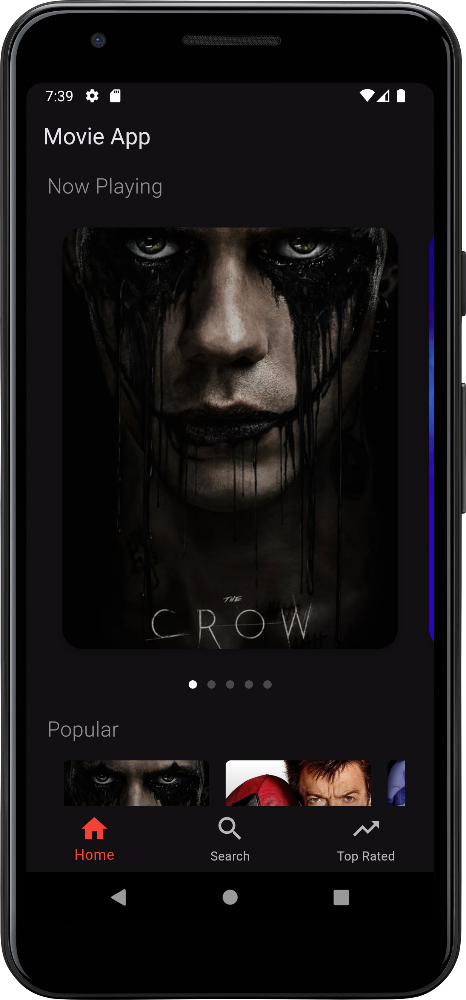
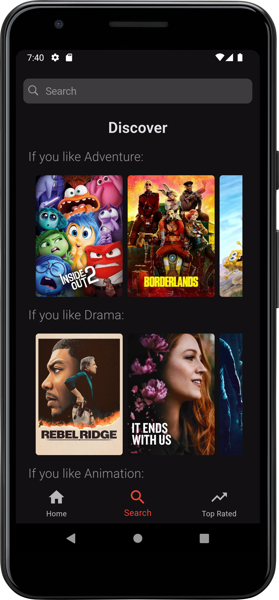
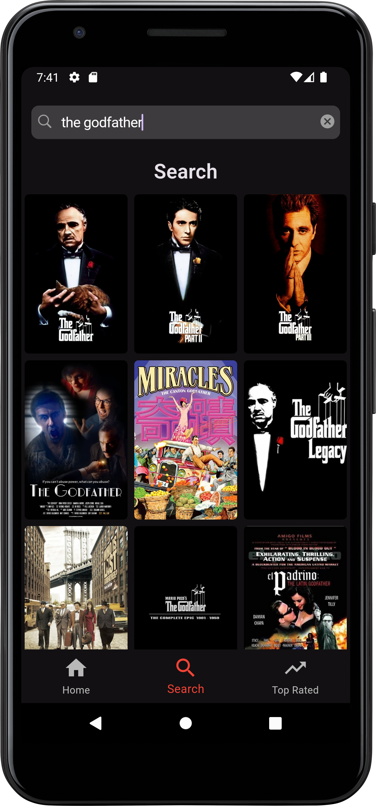
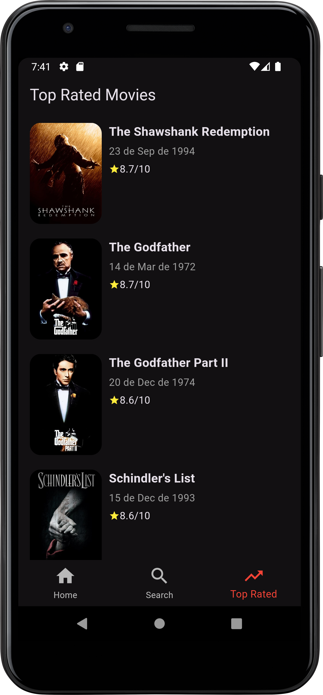

# Movie App

## Descrição

Projeto feito para disciplina de Desenvolvimento Cross Platform do Curso de Sistemas de Informação. O projeto consiste em um app de filmes, em que o usuário pode consultar filmes lançamentos, melhores avaliados, populares, etc..

## Técnologias utilizadas

- `Dart`
- `Flutter`
- `TMDB API`

## Como rodar o projeto

- É necessário ter instalado o Flutter Framework em sua máquina. Para mais informações [acesse a documentação oficial do Flutter](https://docs.flutter.dev/get-started/install).
- Baixe o projeto e o abra no Android Studio ou outra IDE que possua suporte para o flutter.
- Rode o comando ``flutter pub get`` no terminal e aguarde as dependencias serem instaladas.
- Selecione um emulador e execute o arquivo ``main.dart``

## Telas

      

